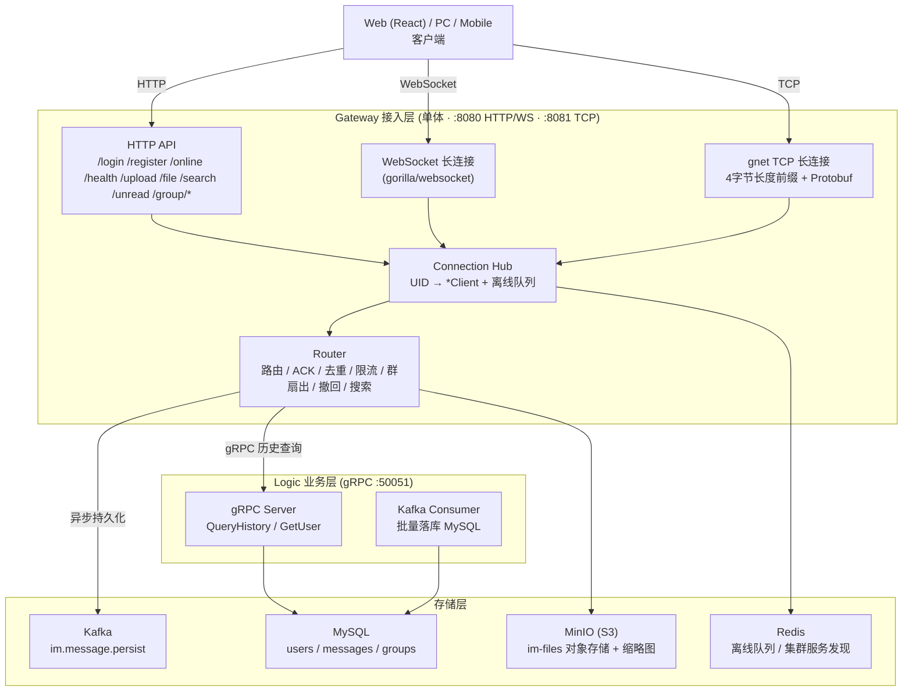

# IM — Go 即时通讯系统


基于 Go 构建的即时通讯（IM）系统：WebSocket / TCP 双传输协议、单聊 / 群聊、文件上传、全文搜索、消息撤回、多网关集群。前后端分离，Docker 一键部署，GitHub Actions 自动构建验证。

## 架构

```
 Client (React SPA)  ──  nginx (:80)  ──  Gateway (:8080 / :8081)
                                              │ gRPC (:50051)
                                           Logic
                                              │
                                 ┌────────────┼────────────┐
                               MySQL        Redis        Kafka      MinIO
```



> 图中是当前代码的真实运行视图。更多图（热路径 / 群聊扇出 / 跨网关转发 / 集群拓扑 / 部署拓扑等）见 [docs/08-architecture-diagrams.md](docs/08-architecture-diagrams.md)。

- **Gateway**：连接层，WebSocket + gnet TCP + HTTP API。消息路由、ACK、去重、限流、群扇出、离线存储、撤回、搜索。
- **Logic**：业务层，gRPC 服务 + Kafka Consumer，消息持久化、历史查询、群组管理。
- **Frontend**：React + TypeScript + Tailwind CSS，响应式单页应用。

## 功能

| 模块 | 说明 |
|------|------|
| 实时消息 | 单聊 / 群聊，在线推送 + 离线拉取，消息 ACK 与去重 |
| 双传输协议 | WebSocket（gorilla/websocket）+ 裸 TCP（gnet v2），Transport 接口统一 |
| 用户系统 | 注册 / 登录（JWT + bcrypt）、在线状态、角色管理（admin） |
| 好友系统 | 添加 / 接受 / 拒绝 / 删除，WebSocket 实时通知 |
| 群组管理 | 创建 / 加入 / 离开 / 踢人 / 改名 / 转交，群通知（member_joined / member_left） |
| 未读计数 | 按会话追踪未读消息数，已读回执实时清除 |
| 消息历史 | 分页查询历史消息（MySQL 持久化 + Kafka 异步写入） |
| 全文搜索 | CmdSearch 协议 + REST API，支持按关键词、会话、消息类型过滤 |
| 文件上传 | 图片 / 文件上传到 MinIO（S3），自动生成 200px 缩略图 |
| 消息撤回 | 2 分钟撤回窗口，撤回通知实时推送给对端 |
| 多网关集群 | 一致性哈希路由（CRC32 + 150 虚拟节点），跨节点 gRPC 转发 |
| 动态集群 | gRPC 健康探测 + Redis 服务发现，自动上下线 |
| 速率限制 | 每 UID 令牌桶限流（默认 10 msg/s，突发 20） |
| 管理后台 | 系统统计、用户管理、消息浏览，仅 admin 角色可见 |

## 快速开始

### 前置要求

- [Docker](https://docs.docker.com/get-docker/) + Docker Compose
- Go 1.26+（仅本地开发需要）

### 首次构建与启动

```bash
# 克隆项目
git clone https://github.com/641-git641/GO-IM.git && cd GO-IM

# 构建所有镜像（首次或依赖变更时需要）
docker-compose build

# 启动所有服务（后台运行）
docker-compose up -d

# 查看各服务运行状态
docker-compose ps
```

浏览器打开 [http://localhost](http://localhost)，注册账号即可使用。

> **国内网络加速**：如果 `docker-compose build` 拉取依赖缓慢，可通过代理构建：
> ```bash
> set HTTP_PROXY=http://127.0.0.1:<port>      # Windows (cmd)
> # 或
> export HTTP_PROXY=http://127.0.0.1:<port>   # Linux / macOS / Git Bash
>
> docker-compose build --build-arg HTTP_PROXY=$HTTP_PROXY --build-arg HTTPS_PROXY=$HTTP_PROXY
> ```
>
> Go 镜像使用 `GOPROXY=https://goproxy.cn,direct`，无需额外配置。

### 修改代码后重新构建

```bash
# 只改 Go 代码 → 重建 Gateway
docker-compose build gateway && docker-compose up -d gateway

# 只改 Go 代码 → 重建 Logic
docker-compose build logic && docker-compose up -d logic

# 只改前端 → 重建前端
docker-compose build frontend && docker-compose up -d frontend

# 改了 Protobuf / go.mod → 重建所有
docker-compose build --no-cache && docker-compose up -d
```

### 停止与清理

```bash
docker-compose down              # 停止所有服务（保留数据卷和镜像）
docker-compose down -v           # 停止并删除数据卷（数据清空）
docker-compose down -v --rmi all # 同时删除构建的镜像
```

### 服务端口

| 端口 | 服务 | 说明 |
|------|------|------|
| `:80` | nginx / 前端 | 浏览器入口 |
| `:8080` | Gateway HTTP + WebSocket | API / 长连接 |
| `:8081` | Gateway gnet TCP | 裸 TCP 长连接 |
| `:50051` | Logic gRPC | 内部服务 |
| `:6379` | Redis | 离线消息 / 集群发现 |
| `:3307` | MySQL | 用户 / 消息持久化 |
| `:9093` / `:9094` | Kafka | 容器内 / 宿主机 listener |
| `:9000` / `:9001` | MinIO API / Console | 对象存储 |

## 项目结构

```
im/
├── cmd/
│   ├── gateway/             # Gateway 入口（连接层）
│   └── logic/               # Logic 入口（业务层）
├── internal/
│   ├── gateway/             # Gateway 核心：Server, Hub, Router, Client, Transport,
│   │                       #   GnetHandler, HashRing, Cluster, GroupStore, ...
│   ├── logic/               # Logic gRPC Server + Kafka Consumer
│   ├── mq/                  # Kafka Producer + Consumer
│   ├── repo/                # MySQL 数据持久层（UserStore, MessageStore）
│   └── pkg/
│       ├── jwt/             # JWT 签发 / 验证
│       └── snowflake/       # 分布式 ID 生成器
├── bench/
│   ├── kit/                 # 压测客户端库（集成测试复用）
│   └── loadtest/            # 压测主程序（5 个场景）
├── api/proto/
│   ├── message.proto        # 核心消息体（客户端 ↔ 服务端）
│   ├── logic.proto          # Gateway → Logic gRPC 接口
│   └── gateway.proto        # Gateway → Gateway gRPC 接口
├── configs/                 # 配置文件（本地 / Docker / 压测 / 生产）
├── web/                     # React 前端（TypeScript + Vite + Tailwind）
│   ├── src/
│   │   ├── components/      # UI 组件（chat, contact, group, friend, admin）
│   │   ├── pages/           # 页面（Chat, Contacts, Profile, Admin…）
│   │   ├── stores/          # Zustand 状态管理
│   │   ├── lib/             # API 客户端、WebSocket 管理、认证工具
│   │   └── hooks/           # 自定义 Hooks
│   └── nginx.conf           # 前端 nginx 配置（SPA + API 反向代理）
├── docs/                    # 设计文档、架构图、压测报告
├── deploy/                  # 生产部署：init-ssl.sh / nginx.prod.conf / config.prod.json
├── .github/workflows/       # GitHub Actions CI 流水线
├── docker-compose.yml       # 开发编排（一键部署）
├── docker-compose.prod.yml  # 生产编排（SSL 终止 + 自动续期）
├── Dockerfile.gateway / .logic / .frontend
└── LICENSE
```

## 本地开发

### 运行依赖服务

```bash
# 只启动中间件（Redis, MySQL, Kafka, MinIO）
docker-compose up -d redis mysql kafka minio
```

### 启动 Gateway / Logic / 前端

```bash
# 使用本地配置（configs/config.json）
go run ./cmd/gateway/

# Logic（需要 MySQL）
go run ./cmd/logic/

# 前端
cd web
npm install
npm run dev          # Vite 开发服务器，默认 :5173
```

### 运行测试

```bash
# 全部单元测试（CI 中带 MySQL 完整跑，见徽章）
go test ./internal/...

# 集成测试（内存模式，无需外部服务；本地需 Gateway 跑在 :18080）
go test ./cmd/gateway/ -v

# 单个包
go test ./internal/gateway/ -v -run TestRouter
```

## 压测

完整报告见 [docs/09-load-test-report.md](docs/09-load-test-report.md)。工具：`bench/kit`（客户端库）+ `bench/loadtest`（压测主程序）。

### 场景命令

```bash
# S1 连接抖动：1000 目标连接，50 conn/s，60s
go run ./bench/loadtest -scenario churn -connections 1000 -conn-rate 50 -duration 60s

# S2 单聊吞吐：1000 用户 × 20 msg/s，60s
go run ./bench/loadtest -scenario chat -users 1000 -rate 20 -duration 60s

# S3 群聊扇出：500 人群
go run ./bench/loadtest -scenario group -group-size 500 -groups 1 -msgs 100 -duration 30s

# S4 历史/搜索：50 并发 HTTP + 10 WS 翻页
go run ./bench/loadtest -scenario search -workers 50 -history-workers 10 -duration 60s -query bench-chat

# S5 心跳浸泡：2000 连接 × 10 分钟，15s 心跳
go run ./bench/loadtest -scenario heartbeat -connections 2000 -duration 10m -interval 15s
```

### 实测结果（单机回环，2026-08）

| 场景 | 配置 | 结果 |
|------|------|------|
| S1 连接抖动 | 3000 次完整生命周期 | **100% 成功**，无泄漏 |
| S2 单聊吞吐 | 1000 连接 · 1,194,000 条消息 | **19,900 msg/s**，100% 送达/ACK，投递 P99=16ms |
| S3 群聊扇出 | 500 人群 · 43,413 次投递 | **扇出 P99=25ms** |
| S4 历史查询 | 21,170 次 · 635,100 条消息（352 qps） | WS 翻页 P99=73ms |
| S5 心跳浸泡 | 2000 连接 · 10 分钟 · 78,000 心跳 | **零失败**，内存 44MB 稳定 |

**已知边界（诚实标注）**：

- HTTP 全文搜索（ngram FULLTEXT）在 50 并发下 P99≈32s，需专用方案（Elasticsearch / LIKE 前缀索引），不适合高并发在线搜索。
- 异步持久化（Gateway→Kafka→MySQL 双写，64 worker）在 3k msg/s 下持久化率约 22%——在线消息已全部送达，落库为尽力而为，是容量问题而非丢数据 bug。生产可按需提升并发或改为只写 Kafka。

## 配置

配置文件通过 `CONFIG_PATH` 环境变量指定，不存在时自动使用默认值。各环境配置：

| 文件 | 用途 |
|------|------|
| `configs/config.json` | 本地开发（默认路径） |
| `configs/config.docker.json` | 开发 Docker 栈（dev compose，容器名地址） |
| `configs/config.bench.json` | 压测（关闭限流、宿主机地址、pprof） |
| `deploy/config.prod.json` | 生产模板（占位符经 `deploy/render-config.sh` 渲染为 gitignore 的 `configs/config.prod.generated.json`，prod compose 的 `CONFIG_PATH=/etc/im/config.prod.generated.json` 指向它） |

### 核心配置项

```json
{
  "gateway": {
    "http_addr": ":8080",
    "tcp_addr": ":8081",
    "transport": "both",             // "websocket" | "gnet" | "both"
    "mysql":  { "enabled": true, "dsn": "..." },
    "kafka":  { "enabled": true, "brokers": ["kafka:9093"] },
    "redis":  { "addr": "redis:6379" },
    "object_storage": { "enabled": true, "endpoint": "minio:9000" },
    "rate_limit": { "enabled": true, "rate": 10, "burst": 20 },
    "auth": { "dev_mode": false }
  },
  "admin_uids": ["admin"],
  "jwt": { "secret": "change-me", "expiration": "168h" },
  "snowflake": { "worker_id": 1 },
  "stability": { "max_connections": 0, "pprof_enabled": false }
}
```

完整配置说明见 [configs/config.example.json](configs/config.example.json)。

## 通信协议

### 核心消息体

所有消息使用 Protocol Buffers 编码，统一 `Message` 结构：

```protobuf
message Message {
  string cmd      = 1;   // 命令字：chat / heartbeat / history / ...
  string from     = 2;   // 发送者 UID（服务端覆写）
  string to       = 3;   // 接收者 UID / Group ID
  int32  chatType = 4;   // 0=单聊, 1=群聊
  int32  msgType  = 5;   // 0=文本, 1=图片, 2=文件
  bytes  content  = 6;   // 消息内容（文本 / JSON）
  string msgId    = 7;   // Snowflake 消息 ID
  string seq      = 8;   // 客户端序列号
  // ...
}
```

### 传输层编码

| 传输方式 | 编码 |
|----------|------|
| WebSocket | Protobuf 二进制帧 |
| gnet TCP | `[4-byte Big-Endian Length][Protobuf Payload]` |
| gRPC | HTTP/2 + Protobuf |
| Kafka | Protobuf Value + Snowflake MsgID Key |

详细协议规范见 [docs/07-api-reference.md](docs/07-api-reference.md)。

## CI/CD

### 持续集成（CI）

`.github/workflows/ci.yml` —— push main / PR 触发，concurrency 自动取消旧 run。**6 个 job 全部绿色才算通过**：

| Job | 内容 |
|------|------|
| `lint` | gofmt 检查 + go vet + go build |
| `unit` | 单元测试（MySQL 8.4 service container，自动激活 repo 测试） |
| `integration` | 5 个集成测试（内存模式，无需外部服务） |
| `kafka` | Kafka Producer→Consumer 端到端（KRaft 单节点） |
| `frontend` | npm ci + build |
| `docker` | 三个镜像构建（buildx + GHA 缓存，只构建不推送） |

### 持续部署（CD）

> CD 流水线（[.github/workflows/cd.yml](.github/workflows/cd.yml)：push main → GHCR 镜像 → SSH 部署 + 健康检查）已接入生产服务器（goimchat.site）。需配置 **11 个必配 secrets**：SSH_HOST / SSH_USER / SSH_KEY / SSH_PORT / DOMAIN / JWT_SECRET / MYSQL_ROOT_PASSWORD / MYSQL_PASSWORD / MINIO_ROOT_USER / MINIO_SECRET_KEY / ADMIN_UID。**GHCR_USER / GHCR_TOKEN 可选**——镜像公开时匿名拉取即可，配了才执行 `docker login`（镜像转私有后按需补）。

## 生产部署

生产编排 [docker-compose.prod.yml](docker-compose.prod.yml)：仅 `proxy`（nginx + SSL 终止）对外暴露 80/443，内部服务（MySQL / Redis / MinIO / Gateway / Frontend）走 Docker 内网；`certbot` 每 12h 自动续期证书。

> **2C2G 最小栈**：为适配 2GB 内存云服务器，生产形态省略了 Kafka 与 Logic——网关直连 MySQL 异步持久化（`router.doPersist` 双路径），历史 / 群聊 / 搜索 / 未读不受影响，基线内存约 500-600MB，全部服务带 `mem_limit`（上限合计 ~1.6G，含可观测 agent alloy）。换大服务器可恢复完整形态（加回 kafka / logic 服务与 `config.prod.json` 的对应配置）。

### 服务器前置

- Ubuntu + Docker + Compose v2
- 开放端口 80/443（云安全组 + 防火墙）
- 域名 A 记录已解析到服务器 IP
- 2G 内存机器先配 swap（防启动峰值 OOM）：

  ```bash
  sudo fallocate -l 2G /swapfile && sudo chmod 600 /swapfile && sudo mkswap /swapfile && sudo swapon /swapfile
  echo '/swapfile none swap sw 0 0' | sudo tee -a /etc/fstab
  ```

- 首次 `git clone` 到服务器（**勿执行 `git clean -fdx`**，会误删证书与配置）

### 首次部署

```bash
# 1. 获取 Let's Encrypt 证书（HTTP-01 验证，先跑 dry-run 再正式获取）
bash deploy/init-ssl.sh your-domain.com

# 2. 生成凭据并写入 .env（compose 的 MySQL / MinIO 环境变量，密码自拟）
cat > .env <<EOF
MYSQL_ROOT_PASSWORD=<root 密码>
MYSQL_PASSWORD=<应用密码>
MINIO_ROOT_PASSWORD=<MinIO 密码>
EOF

# 3. 渲染生产配置（生成 gitignore 的 configs/config.prod.generated.json；
#    与 CD 流水线同一渲染管线。注意 MYSQL_PASSWORD / MINIO_ROOT_PASSWORD
#    必须与第 2 步 .env 一致——应用即用 root 访问 MinIO）
DOMAIN=your-domain.com \
JWT_SECRET=$(openssl rand -base64 64) \
MYSQL_PASSWORD=<应用密码> \
MINIO_SECRET_KEY=<MinIO 密码> \
ADMIN_UID=<你的 UID> \
bash deploy/render-config.sh

# 4. 启动（本地构建镜像，2 核机器首次约 5-10 分钟；
#    之后可配 GHCR 凭据改用 docker compose -f docker-compose.prod.yml -f docker-compose.cd.yml pull + up -d）
docker compose -f docker-compose.prod.yml up -d

# 5. 验证
curl -I https://your-domain.com/health
```

### 安全注意事项

- 生产必须 `auth.dev_mode: false`（启用 bcrypt 密码校验）
- 修改 JWT secret、MySQL / MinIO 密码，勿用默认值
- `admin_uids` 仅配置可信账号
- SSL 证书首次由 `init-ssl.sh` 获取，之后 certbot 自动续期

## 可观测性

网关默认暴露 Prometheus `/metrics` 端点（`stability.metrics_enabled: true`），由 `prometheus/client_golang` 聚合 **20+ 核心指标**（`im_` 前缀，另有 `go_*` 运行时指标），覆盖连接数、消息吞吐、投递延迟、持久化成败、限流拒绝与命令分布。

### 本地验证

```bash
curl -s localhost:8080/metrics | grep '^im_'   # im_online_connections / im_messages_received_total / ...
```

### 核心指标

| 指标 | 含义 |
|------|------|
| `im_online_connections` | 在线连接数（WebSocket + gnet TCP） |
| `im_messages_received_total{chat_type}` / `im_messages_delivered_total{chat_type}` | 收 / 投递消息数 |
| `im_message_delivery_duration_seconds{chat_type}` | 收到 → ACK 的投递延迟（P50 / P99） |
| `im_delivery_failures_total` | 投递失败转存离线 |
| `im_rate_limit_allowed_total` / `im_rate_limit_rejected_total` | 限流放行 / 拒绝 |
| `im_persist_success_total` / `im_persist_fail_total` / `im_persist_queue_drop_total` | 异步持久化成败与背压 |
| `im_commands_total{cmd}` | 命令分布 |
| `im_duplicate_dropped_total` / `im_group_fanout_sends_total` / `im_dedup_marks_total` / `im_gnet_pool_drop_total` | 去重 / 群扇出 / 队列丢弃 |

### Grafana Cloud 接入（可选）

生产栈含 `alloy` 服务（[deploy/alloy.config.alloy](deploy/alloy.config.alloy)），抓取 `gateway:8080/metrics`（compose 内网）并 remote-write 到 Grafana Cloud 免费版：

1. 注册 [Grafana Cloud 免费账号](https://grafana.com/products/cloud/) → 创建 Prometheus 实例，记下 **Remote Write Endpoint / 实例 ID / token**
2. 在 GitHub 仓库 Settings → Secrets 加 3 个 secret：`GRAFANA_CLOUD_URL` / `GRAFANA_CLOUD_USER`（实例 ID）/ `GRAFANA_CLOUD_TOKEN`
3. 推送 main（或手动触发 CD）重部署，alloy 自动开始上报
4. 在 Grafana Cloud 导入 [deploy/grafana-dashboard.json](deploy/grafana-dashboard.json)，数据源选 Prometheus

> 未配置 3 个 secrets 时 alloy 空转，不影响主栈与 CD 健康检查。

### 结构化日志

两个 main（`cmd/gateway`、`cmd/logic`）已初始化 `log/slog`（JSON 输出到 stdout）；热路径关键日志（投递失败、持久化失败、限流、panic、gnet 队列满、集群不健康）为结构化 `slog.Error/Warn/Info`。其余 `log.Printf` 保持文本格式（混合输出是过渡态）。

## 技术栈

| 层级 | 技术 |
|------|------|
| 语言 | Go 1.26 + TypeScript 6 |
| 前端框架 | React 19 + React Router 7 + Zustand 5 + TanStack Query |
| 前端样式 | Tailwind CSS 3 + Lucide Icons |
| 构建 / 质量 | Vite 8 + Rolldown · oxlint |
| 长连接 | gorilla/websocket + panjf2000/gnet v2 |
| RPC | gRPC + Protobuf（buf + @bufbuild/protobuf） |
| 消息队列 | Apache Kafka（segmentio/kafka-go） |
| 数据库 | MySQL 8.4（database/sql） |
| 缓存 | Redis 7（go-redis/v9） |
| 对象存储 | MinIO（S3 兼容） |
| 认证 | JWT HS256 + bcrypt |
| 反向代理 | nginx（SPA 静态服务 + API 代理） |
| 容器化 | Docker + Docker Compose |
| 持续集成 | GitHub Actions（6 jobs） |
| 可观测性 | Prometheus（client_golang）+ Grafana Cloud（可选） |

## 文档

| 文档 | 说明 |
|------|------|
| [docs/01-architecture-design.md](docs/01-architecture-design.md) | 架构设计与技术选型 |
| [docs/02-code-review.md](docs/02-code-review.md) | 代码审查记录 |
| [docs/03-next-steps.md](docs/03-next-steps.md) | 下一步计划 |
| [docs/04-phase1-implementation.md](docs/04-phase1-implementation.md) | Phase 1 实现记录 |
| [docs/05-phase2-completion.md](docs/05-phase2-completion.md) | Phase 2 完成报告 |
| [docs/06-phase4-completion.md](docs/06-phase4-completion.md) | Phase 4 完成报告 |
| [docs/07-api-reference.md](docs/07-api-reference.md) | 完整 HTTP / WS / TCP 接口文档 |
| [docs/07-message-middleware-design.md](docs/07-message-middleware-design.md) | 消息中间件设计 |
| [docs/08-architecture-diagrams.md](docs/08-architecture-diagrams.md) | Mermaid 架构图集（10 张） |
| [docs/09-load-test-report.md](docs/09-load-test-report.md) | 完整栈压测报告 |
| [docs/10-ci-cd-guide.md](docs/10-ci-cd-guide.md) | CI/CD 入门指南（push 到线上的全流程） |
| [CLAUDE.md](CLAUDE.md) | AI 辅助开发指南 |

## License

MIT
