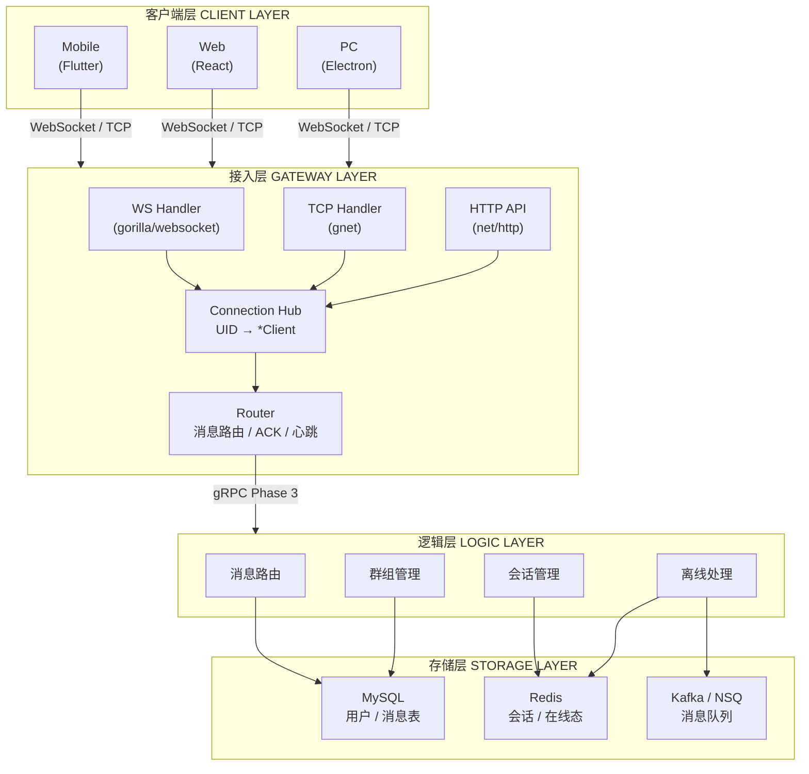
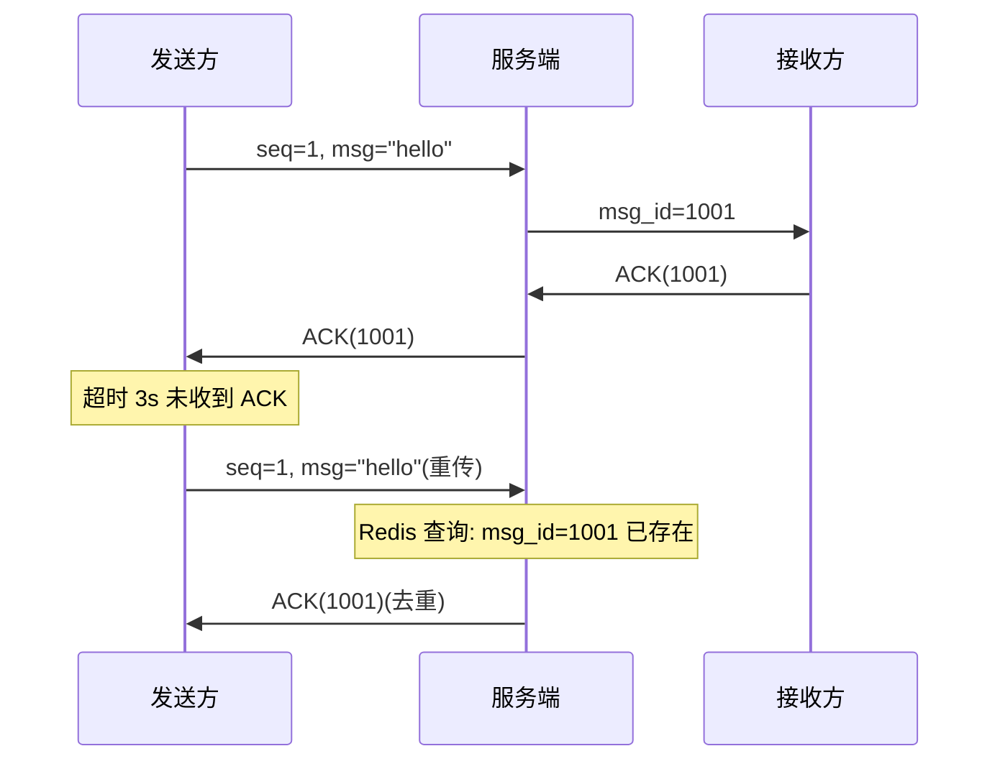
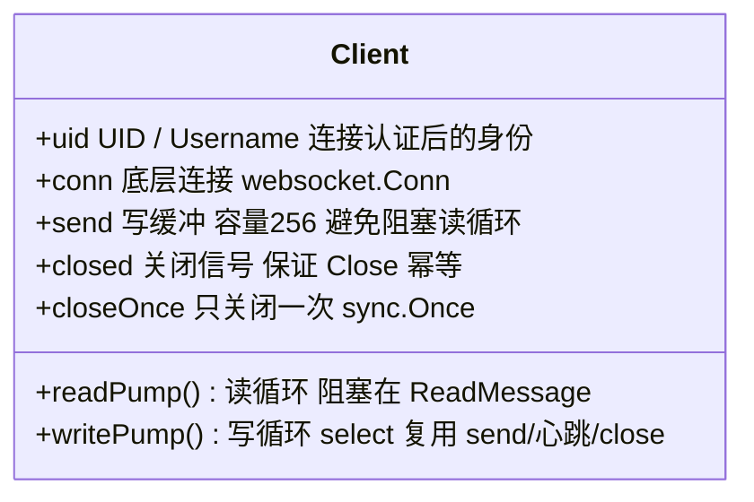
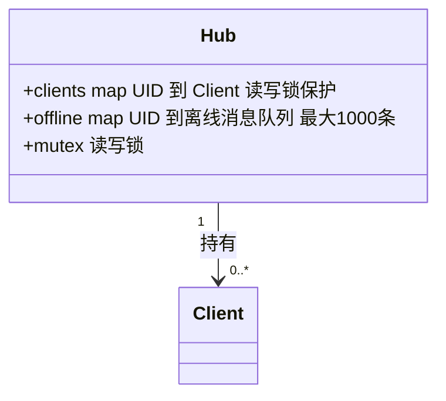
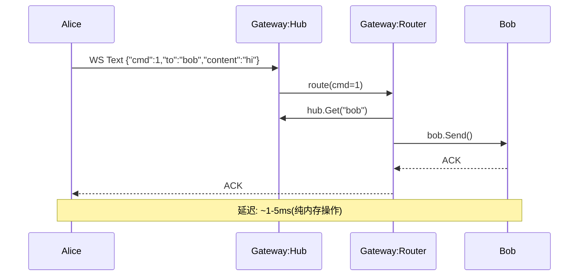
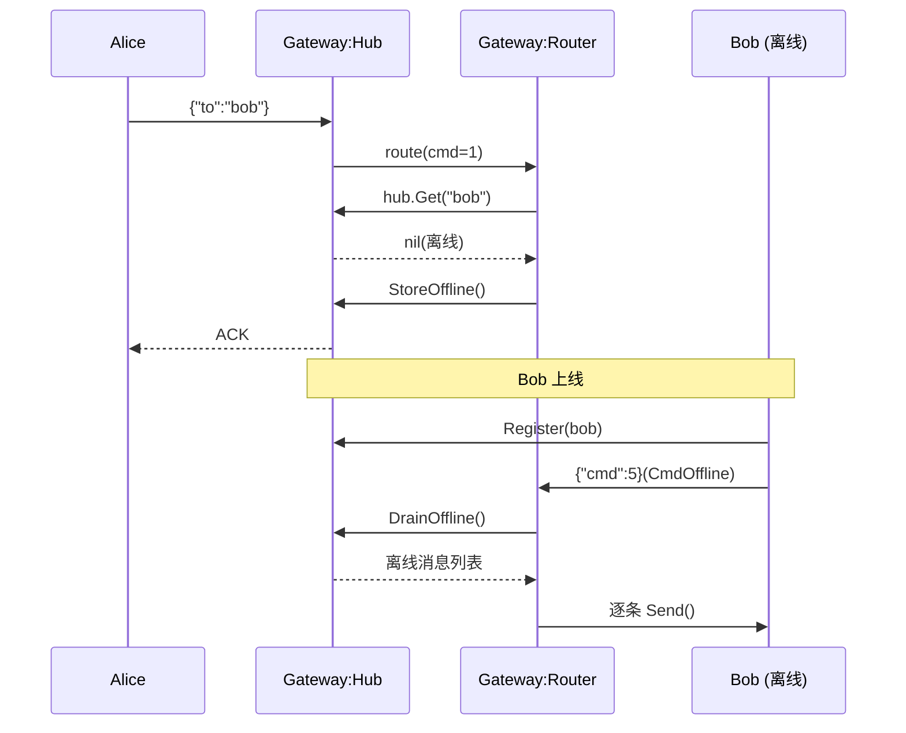
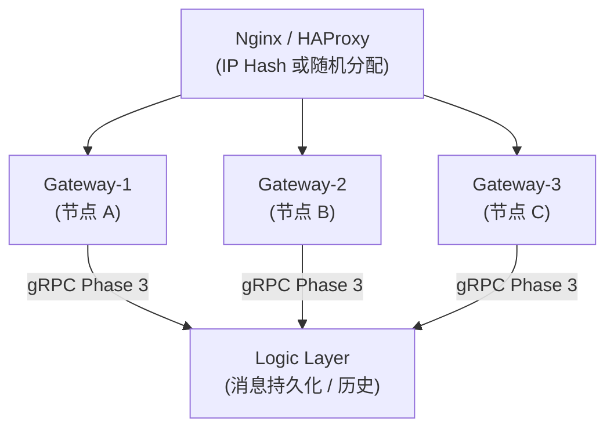
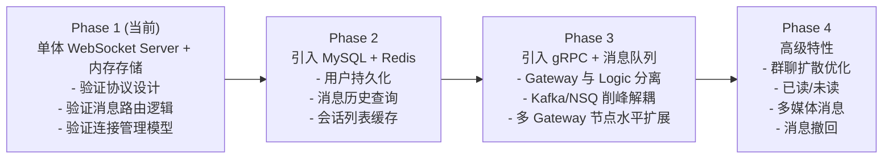

# 01 — 项目架构设计

> 版本: v1.1 | 日期: 2026-07-17 | 阶段: MVP

---

## 1. 概述

本项目是一个基于 Go 语言构建的即时通讯（IM）系统，采用分层架构：**接入层 (Gateway)** → **逻辑层 (Logic)** → **存储层 (Storage)**。当前 MVP 阶段将三层合并为单体服务运行，随规模增长逐步拆分。

### 1.1 架构全景图



> 说明:当前 MVP 阶段为单体进程,上述"层"是逻辑分层而非独立进程;随规模增长按此边界拆分(见 §7)。

---

## 2. 技术选型与理由

### 2.1 长连接方案：gorilla/websocket（当前）+ gnet（演进）

| 维度 | gorilla/websocket | gnet | netpoll |
|------|-------------------|------|---------|
| 协议 | WebSocket | 自定义 TCP | 自定义 TCP |
| 并发模型 | 每连接 2 goroutine | EventLoop (epoll/kqueue) | EventLoop |
| 内存占用 | 较高（~2-4KB/连接） | 极低（~100B/连接） | 极低 |
| 学习曲线 | 低 | 中 | 中 |
| 适用场景 | Web 端 IM、快速原型 | 移动端/PC 长连接、百万级 | 字节内部场景 |

**选型理由：**

> **案例对比** — B 站 GoIM 项目（github.com/Terry-Mao/goim）使用自建 TCP 协议 + epoll 模型，单机支撑 100w+ 长连接，内存占用仅 ~2GB。其核心思路是将连接与业务逻辑解耦：
> - 连接层只负责 I/O 多路复用和协议编解码
> - 业务逻辑通过 Ring Buffer（channel）异步处理
> - 该架构被验证可支撑 B 站弹幕系统日均数十亿级消息

**我们的策略**：MVP 阶段用 gorilla/websocket 快速验证业务逻辑，接口设计预留 TCP 扩展点。当连接数超过 10 万时，Gateway 层可无缝切换为 gnet 实现，Router/Hub 逻辑无需修改。

### 2.2 消息序列化：JSON（当前）→ Protobuf（演进）

```
JSON (MVP):  可读性好、调试方便、前端原生支持，但带宽开销大
             ↓ (连接数 > 1 万时切换)
Protobuf:    体积小 60-80%、编解码快 3-5x、强类型安全、gRPC 原生支持
```

**切换风险**：协议格式已抽象在 `api/proto/message.go`，切换时仅需修改序列化/反序列化两处调用，业务逻辑零改动。

### 2.3 消息可靠性：ACK + 超时重试 + 去重



**参考案例**：WhatsApp 的消息投递使用类似机制 — 每个消息带唯一 ID，服务端存储投递状态，客户端 ACK 后清除。未 ACK 的消息在重连后重新投递。

### 2.4 组件总览

| 组件 | 当前选择 (MVP) | 目标选择 (生产) | 选型理由 |
|------|---------------|----------------|---------|
| 网络框架 | gorilla/websocket | gorilla + gnet | 先验证业务，再优化连接 |
| 序列化 | JSON | Protobuf | 先快后省 |
| 消息队列 | 无（内存直投） | Redis Streams → Kafka | 渐进式引入，避免过度设计 |
| 数据库 | 无（内存存储） | MySQL + Redis | 先跑通流程，再持久化 |
| 服务发现 | 无（单体） | etcd (K8s) | 先单机，再分布式 |
| ID 生成 | Snowflake (内存) | Snowflake (etcd 分配 WorkerID) | 当前占位 WorkerID=1 |
| 日志 | log 标准库 | zap | 先简单后结构化 |

---

## 3. 核心数据结构设计

### 3.1 消息协议

```go
// api/proto/message.go
type Message struct {
    Seq       int64  // 客户端序列号（幂等去重）
    MsgID     int64  // 服务端全局唯一 ID（Snowflake，趋势递增）
    Cmd       int32  // 0=心跳 1=聊天 2=ACK 3=登录 4=登录响应 5=离线请求
    From      string // 发送者 UID（由服务端根据连接认证信息填充，客户端不可伪造）
    To        string // 接收者 UID 或群组 ID
    ChatType  int32  // 1=单聊 2=群聊
    MsgType   int32  // 1=文本 2=图片 3=语音 4=视频
    Content   string // 消息体（二进制用 Base64 编码）
    Timestamp int64  // 毫秒时间戳
    NeedAck   bool   // 是否需要回执
}
```

**设计要点**：
- `From` 字段由服务端填充，客户端传入的 `From` 会被覆盖 — 防止身份伪造
- `MsgID` 使用 Snowflake 算法确保全局唯一且趋势递增，接收端可按此排序
- `Cmd` 字段统一控制面（心跳/ACK）和数据面（聊天）消息，单通道复用

### 3.2 连接模型



### 3.3 Hub 路由表



---

## 4. 数据流分析

### 4.1 在线消息发送（热路径）



### 4.2 离线消息流程



---

## 5. 架构约束与权衡

| 决策 | 选择 | 权衡 |
|------|------|------|
| 单体 vs 微服务 | 当前单体，后续拆分 | MVP 阶段单体降低运维复杂度；拆分接口已预留（Router 可独立为 Logic 服务） |
| 推模式 vs 拉模式 | 在线推，离线拉 | 在线用户消息实时推送保证低延迟；离线用户不再推送，上线后主动拉取 |
| 同步 vs 异步 | 内存同步（当前）→ 异步队列（后续） | 同步简单可靠；异步需引入消息队列但能削峰解耦 |
| 有状态 vs 无状态 | Gateway 有状态（持有连接） | 这是 IM 的固有特征：Gateway 必须知道用户在哪台机器上，无法完全无状态 |
| 内存存储 vs 持久化 | 内存（当前）→ MySQL/Redis（后续） | 内存读写延迟 < 1μs；重启丢数据，仅适合 MVP 验证 |

### 5.5 限流设计

**问题**：当前任何认证用户都可以无上限发送消息，恶意或 Bug 客户端可能通过高频发送导致离线队列爆炸（发送 1 万条消息给 1 万个不存在的用户 → 1 亿条离线消息），耗尽 Hub 内存。

**方案**：令牌桶算法（Token Bucket），per-UID 粒度。

```
        令牌补充速率: 10 token/s
        ┌─────────────────────┐
        │  ┌───────────────┐  │
        │  │  ● ● ● ... ●  │  │  ← 桶容量: 20 tokens (burst)
        │  └───────────────┘  │
        └─────────────────────┘
                 │
        每条消息消耗 1 token
        桶空时拒绝消息，记录日志，不返回 ACK
```

| 参数 | 默认值 | 说明 |
|------|--------|------|
| rate | 10 msg/s | 令牌补充速率。对人类聊天绰绰有余（~600 字/分钟 vs 600 条/秒的限制） |
| burst | 20 | 桶容量，允许短时突发。打字后连续发送多条不必等待 |
| 粒度 | per-UID | 每个用户独立桶，互不影响 |

**实现位置**：`Router.Route()` 入口，在消息校验之后、业务分发之前。被限流的消息不分配 MsgID，不返回 ACK（客户端超时重试时自然降速）。

**参考**：Slack Events API 限制 ~1 msg/s/user；JuggleIM 使用令牌桶算法，默认 100 token/s，桶容量 10。我们的 10 msg/s 偏宽松，Phase 2 可调优。

**演进**：当前限流器存于 Gateway 内存。多 Gateway 场景需将令牌桶状态移至 Redis（INCR + TTL），实现全局限流。

### 5.6 多设备会话模型

**当前 MVP 行为**：`Hub.clients` 是 `map[UID]*Client`，一个 UID 只能有一个连接。当同一账号从另一设备登录时：

```
1. 设备 A 已连接（UID="alice"）
2. 设备 B 发起 WebSocket 连接（UID="alice"）
3. Hub.Register("alice") 检测到旧连接
4. → 向设备 A 发送 CmdKick（reason: "logged in from another device"）
5. → 关闭设备 A 的 WebSocket
6. → 注册设备 B
```

**Kick 通知协议**：

```json
{
    "cmd": 7,
    "content": "logged in from another device",
    "timestamp": 1712345678000
}
```

客户端收到 `CmdKick` 后展示提示："您的账号在其他设备登录，当前设备已下线"，并跳转到登录页。

**Phase 3 演进目标**（参考微信/WhatsApp 的多端模型）：

```
Hub.clients: map[UID] → map[DeviceID]*Client
                         ├── "mobile-abc" → *Client (iPhone)
                         ├── "desktop-xyz" → *Client (Mac)
                         └── "web-pqr" → *Client (Chrome)

消息投递：fan-out 到同一 UID 的所有 DeviceID
设备管理：支持查看在线设备列表、主动踢出指定设备
设备上限：每 UID 最多 3 个同时在线设备（可配置）
```

**参考**：
- 微信：1 手机 + 1 桌面 + 1 网页
- WhatsApp：1 手机 + 最多 4 个链接设备
- Telegram：无限制，所有设备独立同步

### 5.7 水平扩展策略

**当前**：单 Gateway 进程持有所有连接和全部状态，无分布式协调。扩展到多节点时面临两个核心问题：
1. 消息接收者可能在另一个 Gateway 节点上
2. 状态（在线列表、去重缓存、限流桶）是节点本地的

**方案**：一致性哈希 + 内部 RPC 转发。



**消息路由流程**（两阶段）：

*阶段 1 — 负载均衡器分配连接*：
- 客户端通过 Nginx/HAProxy 连接任意 Gateway
- WebSocket 连接建立后，该 Gateway 即为该用户的"Home Gateway"
- 连接级负载均衡，不需要一致性哈希决定连接归属

*阶段 2 — Gateway 间消息路由*：
- Alice（在 Gateway-1）发送消息给 Bob（在 Gateway-2）
- Gateway-1 查本地一致性哈希环：`hash("bob")` → Gateway-2
- Gateway-1 通过内部 gRPC 将消息转发到 Gateway-2
- Gateway-2 本地投递给 Bob 的 WebSocket 连接

**一致性哈希环**：

> 该图保留 ASCII 绘制:哈希环是环形布局,Mermaid 的 flowchart 无法自然表达环状拓扑。

```
                    0
                    │
            ┌───────┴───────┐
            │               │
    Gateway-3 (hash=100)   Gateway-1 (hash=500)
            │               │
            └───────┬───────┘
                    │
              Gateway-2 (hash=800)

hash("alice") = 450 → Gateway-1
hash("bob")   = 700 → Gateway-2
hash("carol") = 200 → Gateway-3
```

**为什么不用 Redis Pub/Sub**：
- 在线到在线消息（热路径）不应该经过额外网络跳
- Gateway 间直连延迟 ~0.5ms（同机房内网），Redis Pub/Sub 额外增加 1-2ms
- 一致性哈希使路由决策是纯本地计算，无需查 Redis

**参考**：B 站 GoIM 的 Comet（连接层）实例通过一致性哈希分片，Logic 层负责跨 Comet 路由。

### 5.8 消息排序保证

**问题**：IM 消息的顺序一致性直接影响用户体验。两条消息"我先发的却显示在后面"会让用户困惑。

**当前保证**：

| 场景 | 排序方式 | 可靠性 |
|------|---------|--------|
| 单 Gateway、同毫秒 | Snowflake 序列号递增 | ✅ 严格有序 |
| 单 Gateway、跨毫秒 | MsgID 趋势递增 | ✅ 有序 |
| 跨 Gateway（未来多节点） | MsgID 近似排序 | ⚠️ 可能出现微小乱序 |

**Snowflake ID 的排序特性**：

> 位布局图保留 ASCII 绘制:二进制位对齐表格用文本表达更精确,Mermaid 无法等价呈现。

```
MsgID = (timestamp - epoch) << 22 | (workerID << 12) | sequence

时间戳部分（高位）决定了 ID 的大致顺序。同一 worker 在连续毫秒内
生成的 ID 严格递增。但不同 worker 在同一毫秒内的 ID 顺序取决于
workerID（workerID 大的排在后面，即使实际时间略早）。
```

**客户端 seq 辅助排序**：

```
发送方每发一条消息递增 seq（1, 2, 3, ...）
接收方按 (From, Seq) 排序，而非仅按 MsgID

这提供了额外的因果顺序保证：
  - Alice 发 "你好" (seq=1)
  - Alice 发 "在吗" (seq=2)
  → 即使 MsgID 乱序，Bob 也能按 seq 正确排序为 "你好" → "在吗"
```

**客户端重排序缓冲区**（推荐客户端实现）：

```
收到消息 → 检查 seq → 当前期望 seq == 当前 seq？
  ├── 是 → 立即展示，期望 seq++
  └── 否 → 暂存缓冲区（最多 500ms）
            ├── 超时 → 按实际顺序展示
            └── 未超时 → 等待缺失的消息到达后按序展示
```

**参考**：WhatsApp 使用服务端分配的时间戳排序，客户端维护 ~500ms 的重排序缓冲区处理跨服务器时钟偏差。微信的消息排序基于服务端接收时间 + 客户端 msgId 双重保证。
## 6. 参考案例

| 项目 | 要点 | 对齐策略 |
|------|------|---------|
| **B 站 GoIM** | 连接层用 Ring Buffer + epoll；业务层通过 gRPC 通信 | 我们的 Client.send channel 类似 Ring Buffer 思路 |
| **OpenIM** | 完整分层架构，支持群聊/朋友圈；Kafka 做消息队列 | Phase 3 引入 Kafka 时参考其消息持久化策略 |
| **WhatsApp** | 基于 XMPP + Erlang OTP；每条消息有唯一 ID 和投递确认 | 我们的 ACK+MsgID 机制对齐此模式 |
| **Telegram** | 自研 MTProto 协议；多数据中心路由 | 我们暂不需要多数据中心，但协议分层设计预留扩展 |

---

## 7. 后续架构演进路径


