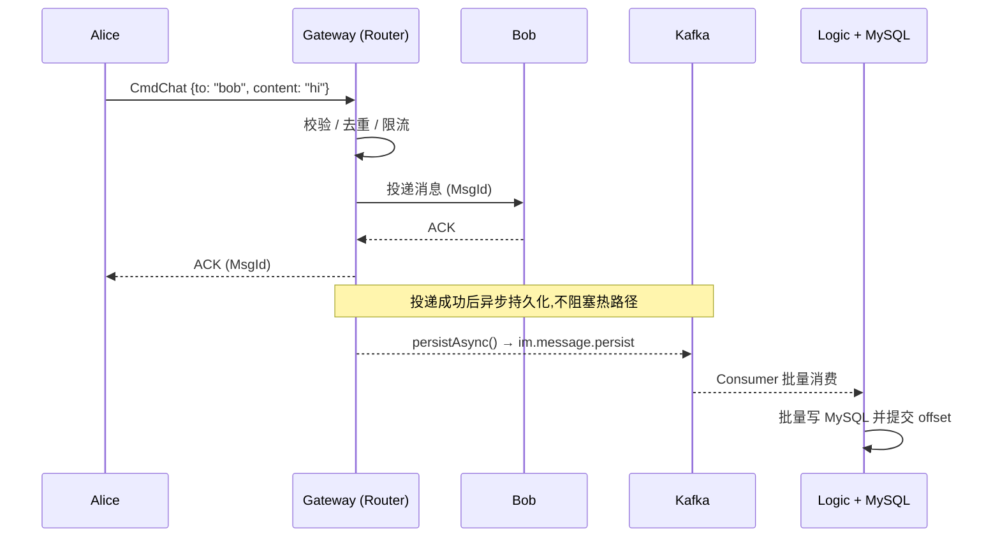
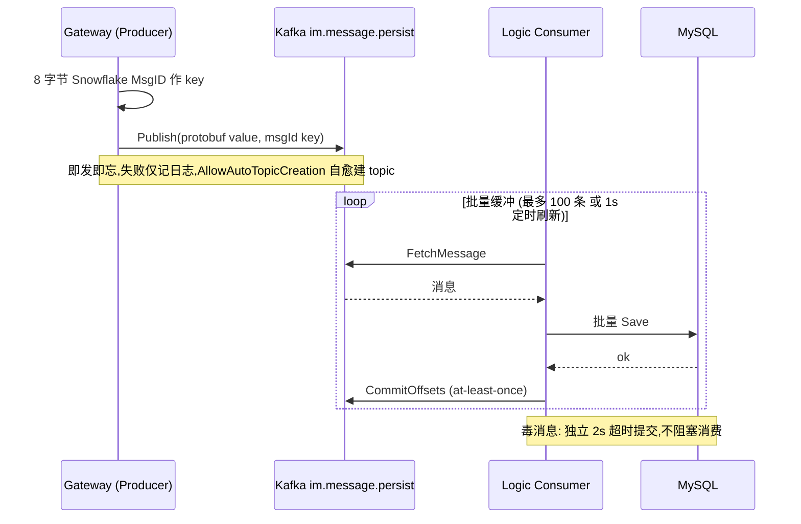
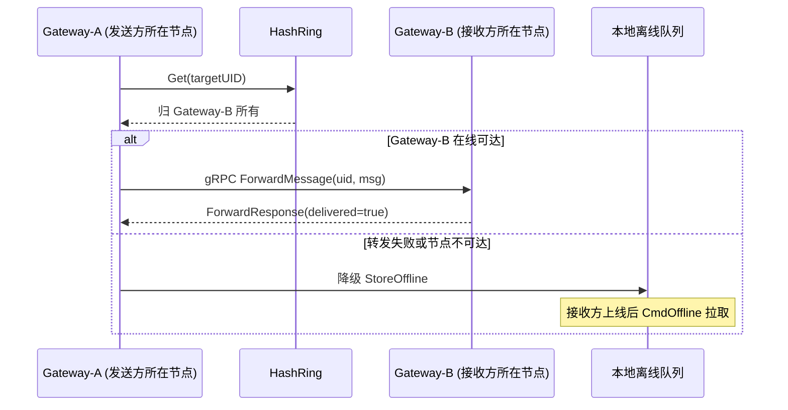
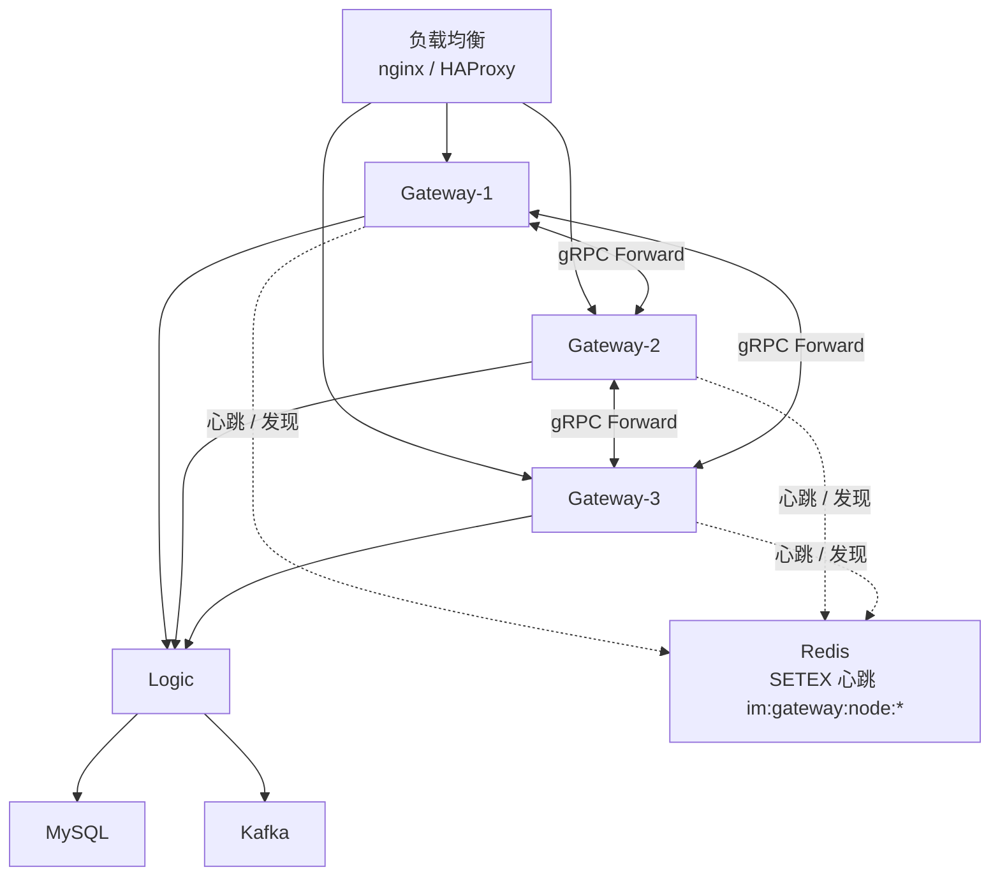
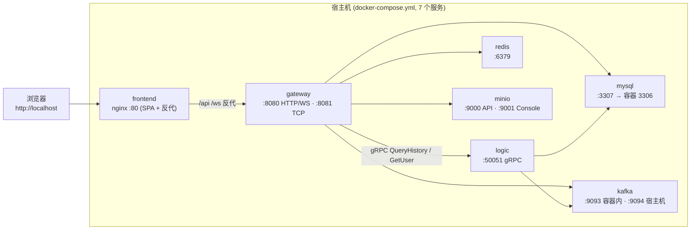
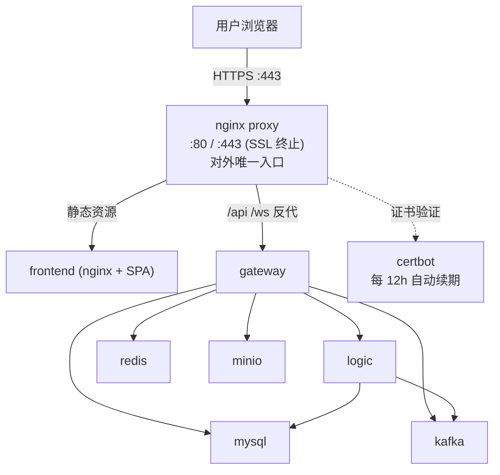
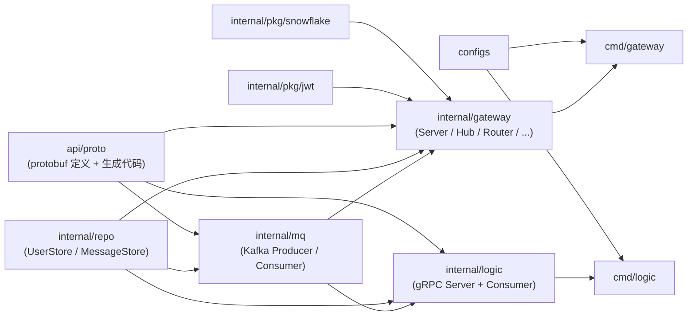
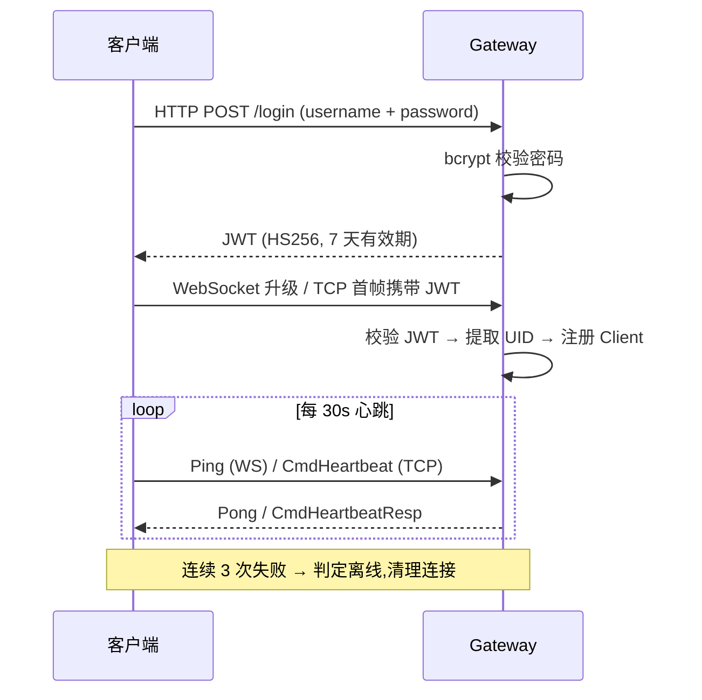
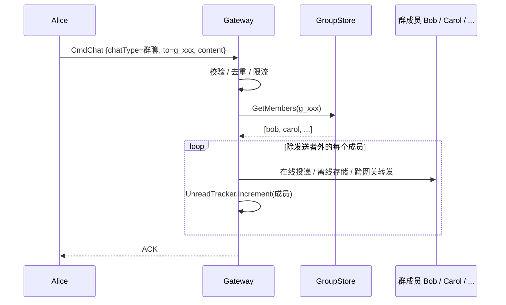

# 08 — 架构图集(Mermaid)

> 版本: v1.0 | 日期: 2026-08-04
>
> 本文档收录系统各层面的 Mermaid 架构图,与代码同步演进。GitHub 原生渲染 Mermaid,修改代码后请同步更新对应图示。
>
> 与 [docs/01-architecture-design.md](01-architecture-design.md) 的关系:docs/01 保留设计决策与论证,本文档聚焦"当前代码真实长什么样"的运行视图。

## 目录

| # | 图 | 类型 | 适用场景 |
|---|-----|------|---------|
| 1 | [系统总览](#1-系统总览) | flowchart | README 架构区、新人入门 |
| 2 | [WS 热路径 + 异步持久化](#2-ws-热路径--异步持久化) | sequence | 单聊消息全链路 |
| 3 | [Kafka 持久化链路](#3-kafka-持久化链路) | sequence | 消息落库 / 至少一次语义 |
| 4 | [跨网关转发三层降级](#4-跨网关转发三层降级) | sequence | 多网关消息路由 |
| 5 | [多网关集群拓扑](#5-多网关集群拓扑) | flowchart | 水平扩展 / 服务发现 |
| 6 | [开发部署拓扑](#6-开发部署拓扑) | flowchart | docker-compose.yml |
| 7 | [生产部署拓扑](#7-生产部署拓扑) | flowchart | docker-compose.prod.yml |
| 8 | [Go 模块图](#8-go-模块图) | graph | 代码结构导航 |
| 9 | [登录 / 心跳生命周期](#9-登录--心跳生命周期) | sequence | 连接建立与保活 |
| 10 | [群聊扇出](#10-群聊扇出) | sequence | 群聊投递 |

---

## 1. 系统总览

> 本文档图 1 供 README 架构区复用。Gateway 当前为单体进程,HTTP / WebSocket / gnet TCP 三种入口统一收敛到 `Hub → Router`。

```mermaid
flowchart TD
    Client["Web (React) / PC / Mobile<br/>客户端"]

    subgraph GW["Gateway 接入层 (单体 · :8080 HTTP/WS · :8081 TCP)"]
        HTTP["HTTP API<br/>/login /register /online /health /upload /file /search /unread /group/*"]
        WS["WebSocket 长连接<br/>(gorilla/websocket)"]
        TCP["gnet TCP 长连接<br/>4字节长度前缀 + Protobuf"]
        Hub["Connection Hub<br/>UID → *Client + 离线队列"]
        Router["Router<br/>路由 / ACK / 去重 / 限流 / 群扇出 / 撤回 / 搜索"]
    end

    subgraph LG["Logic 业务层 (gRPC :50051)"]
        GRPC["gRPC Server<br/>QueryHistory / GetUser"]
        CONS["Kafka Consumer<br/>批量落库 MySQL"]
    end

    subgraph DS["存储层"]
        MYSQL["MySQL<br/>users / messages / groups"]
        REDIS["Redis<br/>离线队列 / 集群服务发现"]
        KAFKA["Kafka<br/>im.message.persist"]
        MINIO["MinIO (S3)<br/>im-files 对象存储 + 缩略图"]
    end

    Client -->|HTTP| HTTP
    Client -->|WebSocket| WS
    Client -->|TCP| TCP
    WS --> Hub
    TCP --> Hub
    HTTP --> Hub
    Hub --> Router
    Router -->|异步持久化| KAFKA
    Router -->|gRPC 历史查询| GRPC
    CONS --> MYSQL
    GRPC --> MYSQL
    Hub --> REDIS
    Router --> MINIO
```

---

## 2. WS 热路径 + 异步持久化

> 投递 + ACK 完成后才异步持久化,`persistAsync()` 不阻塞热路径。

---

## 3. Kafka 持久化链路

> at-least-once 语义:批量写成功后提交 offset;毒消息用独立 2s 超时提交,不阻塞消费。

---

## 4. 跨网关转发三层降级

> 路由链:HashRing 定位 → gRPC Forward → 失败则降级本地离线存储,每层优雅降级。

---

## 5. 多网关集群拓扑

> ClusterManager 通过 gRPC 健康探测 + Redis `SETEX` 心跳维护 HashRing 成员,摘除/恢复自动同步。

---

## 6. 开发部署拓扑

> `docker-compose.yml` 共 7 个服务,依赖链由 healthcheck + `depends_on.condition` 保证顺序。

---

## 7. 生产部署拓扑

> 仅 proxy 暴露宿主端口,内部服务走 Docker 内网。证书由 certbot 每 12h 自动续期(首次需 `deploy/init-ssl.sh`)。

> 内网服务(redis / mysql / kafka / minio / gateway / logic / frontend)不映射宿主端口,仅 Docker 内部网络可达。

> 💡 **2C2G 最小栈形态**(当前 prod compose 默认):省略 Kafka 与 Logic,共 7 个服务——网关直连 MySQL 异步持久化(`router.doPersist` 双路径),历史 / 群聊 / 搜索 / 未读不受影响。换大服务器可恢复上图完整形态。

---

## 8. Go 模块图

> 箭头表示依赖方向(上游依赖下游)。`internal/pkg/*` 为无外部依赖的基础库。

---

## 9. 登录 / 心跳生命周期

> WebSocket 用协议层 Ping/Pong 保活,gnet TCP 用应用层 CmdHeartbeat;连续 3 次失败判定离线。

---

## 10. 群聊扇出

> `CmdChat` 命中群聊后 fan-out 到全部成员(发送者除外),每人独立走"在线投递 / 离线存储 / 跨网关转发",并累计未读数。

